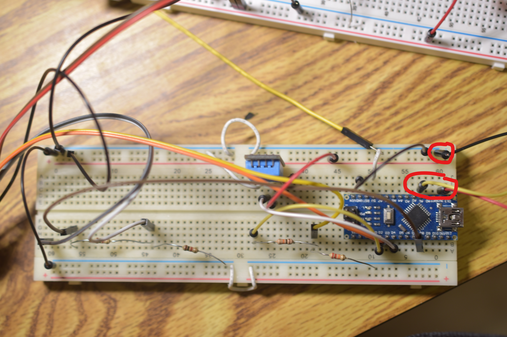

# QuadMonitor
## Description
This is an IOT project that monitors the frisbee playing conditions of the Quad at Houghton College. The main factor that determines playability is the wetness of the soil. It consists of a sensor unit and a server. The sensor unit employs a capacitive soil moisture sensor, along with a temperature and humidity sensor. It sends this data to the server. The future prospect is to use humidity and temperature along with forecast information to estimate the drying time of the Quad. 

The project will:
1. Measure the conditions of the Quad
2. Send readings over Wi-Fi network to a server
3. Store reading in a database
4. Serve a graph of recent readings over the web to users
5. (Future) Use collected data to predict drying times for the Quad
## Sensor Unit Hardware
The sensor unit uses the following hardware:

1. Arduino Nano
2. ESP-01 Wi-Fi board
3. Capacitive soil-moisture sensor
4. DHT-11 temperature and humidity sensor
5. Battery charging board with boost converter
6. 3.3v regulator
7. 2x 5v 500ma solar panel
8. Water-resistant enclosure

### Wiring
The soil moisture sensor is connected directly to 3.3v, ground, and analog pin 1. 

The DHT11 was connected to 3.3v, ground and digital pin 4 with a 1ok pull-up resistor

The ESP-01 operates at 3.3v and draws too much power for the Nano to supply. It requires voltage dividers on the rx and reset pins. The vcc and chip enable pins go to the output of the 3.3v regulator. The ground pin goes to common ground. The rx pin is connected to digital pin 2 through the voltage divider and the tx pin goes to digital pin 3. The reset pin is connected through a voltage divider to digital pin 8 to reset the ESP-01 from deep sleep. 

The power is supplied through 18650 batteries, a power supply board, and solar panels.

## Sensor Unit Code

The sensor unit code consists of the sensor_unit.ino file. This code runs through a loop with the following major steps:
1. Wake up and reset ESP-01
2. Connect to Wi-Fi and server
3. Take reading
4. Send readings with sensor ID
6. Put ESP-01 and Arduino Nano to sleep (currently not working for Arduino)

## Server Code

The server collects data from the Nano, stores it in a database, and serves it to users over the web.
The users for the database can be created via setup.sh and the database is created by setup_db.py. The database has the following Schema:

The server runs two pieces of server code. server.py waits for the Nano to connect and inserts sensor readings and ID into the database
